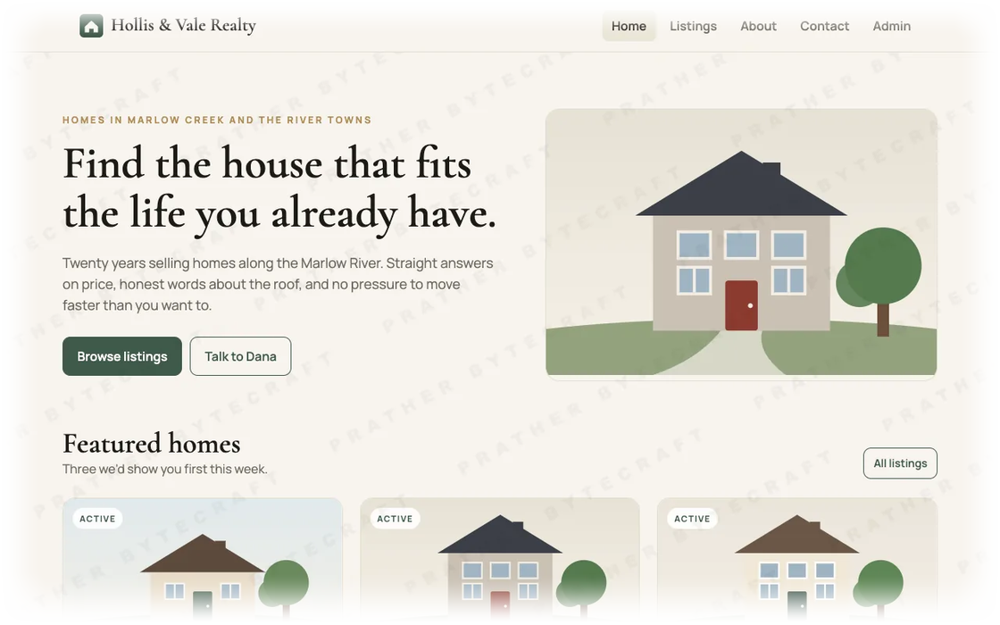
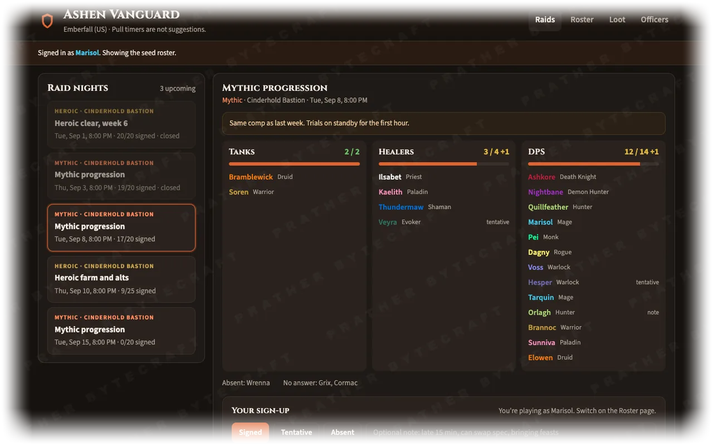

  

## Discrub

<table>
  <tr>
    <td width="72" align="center" valign="middle"></td>
    <td valign="top">
      <b>Export, search, purge and archive your Discord messages from your browser.</b> 
      Over 200,000 users on Chrome and Firefox. 
      <a href="https://chromewebstore.google.com/detail/plhdclenpaecffbcefjmpkkbdpkmhhbj">Chrome Web Store</a> ·
      <a href="https://addons.mozilla.org/firefox/addon/discrub/">Firefox Add-ons</a> ·
      <a href="https://pratherbytecraft.com/discrub">Guide</a> ·
      <a href="https://github.com/pratherbytecraft/discrub">Source</a>
    </td>
  </tr>
</table>

## Discord bots

<table>
  <tr>
    <td width="72" align="center" valign="middle"></td>
    <td valign="top">
      <b>Retrostat</b> · Statistics for any date range of a server's history 
      Who posted the most, who got mentioned, which channels were busiest. Ranked lists with a chart and a CSV. 
      <a href="https://discord.com/oauth2/authorize?client_id=1541785946343612448&integration_type=0">Add to server</a> ·
      <a href="https://pratherbytecraft.com/retrostat">Guide</a>
    </td>
  </tr>
  <tr>
    <td width="72" align="center" valign="middle"></td>
    <td valign="top">
      <b>Scour</b> · Deletes messages by rule, at any age, with a receipt 
      Counts first and deletes after you confirm. Nightly retention works past the 14 day limit other bots stop at. 
      <a href="https://discord.com/oauth2/authorize?client_id=1542622833388032050&integration_type=0">Add to server</a> ·
      <a href="https://pratherbytecraft.com/scour">Guide</a>
    </td>
  </tr>
  <tr>
    <td width="72" align="center" valign="middle"></td>
    <td valign="top">
      <b>Vested</b> · Roles with an expiry date 
      Grant a role for a week, a month, or until a date. Vested removes it when the time is up. 
      <a href="https://discord.com/oauth2/authorize?client_id=1543813583459323967&integration_type=0">Add to server</a> ·
      <a href="https://pratherbytecraft.com/vested">Guide</a>
    </td>
  </tr>
</table>

## Packages and apps

<table>
  <tr>
    <td width="72" align="center" valign="middle"></td>
    <td valign="top">
      <b>ClipShot</b> · A macOS menu bar app for your recent screenshots 
      Lists your latest captures. Copy file paths one at a time or in bulk, drag files into other apps, and browse your capture history. 
      <a href="https://github.com/pratherbytecraft/ClipShot">Source</a>
    </td>
  </tr>
  <tr>
    <td width="72" align="center" valign="middle"></td>
    <td valign="top">
      <b>discrub-core</b> · The library behind Discrub 2.x 
      Discord API access, message formatting, and the export pipeline. 
      <a href="https://www.npmjs.com/package/discrub-core">npm</a> ·
      <a href="https://github.com/pratherbytecraft/discrub-core">Source</a>
    </td>
  </tr>
  <tr>
    <td width="72" align="center" valign="middle"></td>
    <td valign="top">
      <b>drip-fs</b> · Streaming downloads for web apps and browser extensions 
      Writes large files to disk as they arrive, so memory use stays flat. 
      <a href="https://www.npmjs.com/package/drip-fs">npm</a> ·
      <a href="https://github.com/pratherbytecraft/drip-fs">Source</a>
    </td>
  </tr>
</table>

## Custom work

Prather Bytecraft builds and hosts sites and apps for businesses. Email [workbench@pratherbytecraft.com](mailto:workbench@pratherbytecraft.com) or read more at [pratherbytecraft.com](https://pratherbytecraft.com/#custom-work).

Working demos at [demos.pratherbytecraft.com](https://demos.pratherbytecraft.com/?src=github). Fictional businesses, real code.

---

